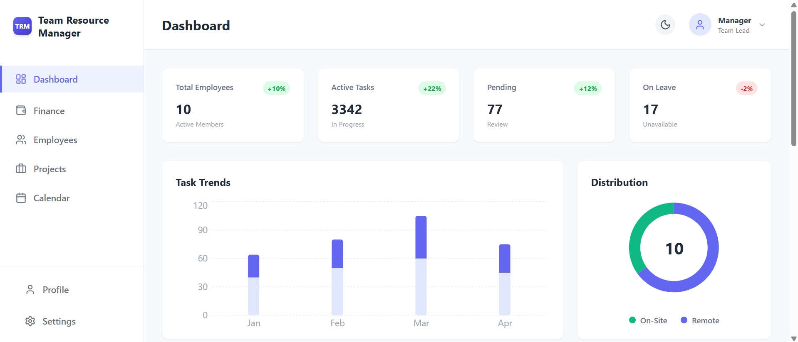
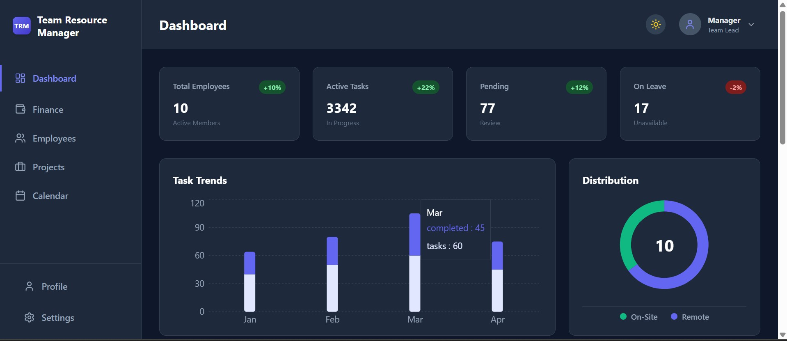

# Team Resource Manager (TRM)

  

A Full-Stack Enterprise Dashboard for managing employees, projects, and financial resources. Built with a robust **Spring Boot** backend and a responsive **React** frontend.

## 🚀 Features

- **Employee Management:** Add, edit, and remove employees with real-time database updates.
- **Kanban Board:** Interactive drag-and-drop style project tracking (To Do, In Progress, Done).
- **Financial Analytics:** Visual breakdown of budget, income, and expenses using Recharts.
- **Dark Mode:** Fully integrated system-wide dark theme.
- **Calendar Integration:** Visual deadline tracking for active projects.

## 🛠️ Tech Stack

### **Backend (Java)**
- **Framework:** Spring Boot 3.0
- **Database:** H2 In-Memory (Dev) / MySQL (Prod)
- **API:** RESTful Endpoints
- **Tools:** Maven, Lombok, Hibernate JPA

### **Frontend (React)**
- **Framework:** React.js (Vite)
- **Styling:** Tailwind CSS
- **Charts:** Recharts
- **Icons:** Lucide React

## 📸 Screenshots

| **Dashboard** | **Dark Mode** |
|:---:|:---:|
|  |  |

## 🔧 Getting Started

### 1. Backend Setup
```bash
cd manager
./mvnw spring-boot:run
```

### 2. Frontend Setup
```bash
cd frontend
npm install
npm run dev
```

### Developed by Ansh Kumar Singh

### **Step 3: Push the README**
```bash
git add README.md
git commit -m "Docs: Add professional README"
git push
```
